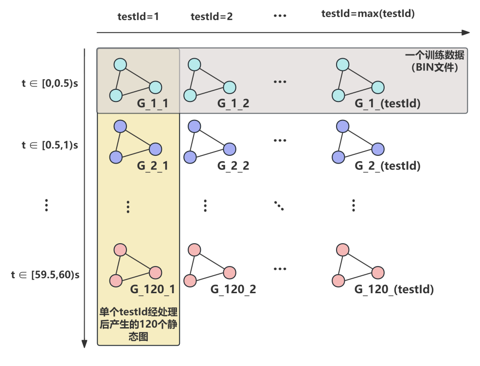

# REDMME

这是`“华为杯”第二十一届中国研究省数学建模竞赛B题`​ 解决方案的代码仓库。

WLAN 优化的核心问题在于吞吐量预测。为了在复杂的实际场景中实现 精准且高效的吞吐量预测，本文采用动态图神经网络（DGNN）作为求解策略。 DGNN 能够有效处理图结构和时序关系的特征，深入分析影响 WLAN 中接入点 （AP）及整个网络吞吐量的关键因素，捕捉网络节点间的复杂交互关系。我们将 WLAN 的部署过程抽象为动态图，并将吞吐量预测问题建模为图节点特征的预 测问题。通过构建和训练模型，成功应对了 WLAN 吞吐量预测中的挑战。

# 环境配置

### 硬件环境

1. cuda 11.8
2. ubuntu 20.04

### 软件环境

* python >= 3.9.7
* numpy >= 1.20.3
* pytorch >= 1.10.2
* dgl >= 0.8.0
* xgboost >= 1.5.2
* scikit-learn >= 0.24.2

```txt
# 安装 DGL
pip install  dgl -f https://data.dgl.ai/wheels/torch-2.1/cu118/repo.html
# 安装其他环境
pip install xgboost 
pip install scikit-learn
```

# 数据准备

数据构建的完整代码见仓库`data_process.ipynb`​。

## 数据构建流程

我们将官方给出的原始数据转换成了图数据，具体分为一下几个部分:

1. 提取点边特征：该步骤的主要目标是从 excel 格式的文件中读取 WLAN 网络信息。将其分为三个类型（图特征、点特征、边特征），图特征将用于划分数据集，而点特征和边特征将分别绑定在图网络的点和边上。

|参数名称|含义|特征类型|
| :--------: | :----------------------------------: | :------------: |
|test_id|测试编号|图特征|
|test_dur|一次测试的时间|图特征|
|loc|AP 和 STA 部署在某一指定位置的编号|点特征|
|bss_id|同一拓扑里的 BSS 编号|点特征|
|ap_name|AP 的名字|预处理后舍去|
|ap_id|AP 编号|边特征|
|sta_mac|STA 的 MAC 地址|预处理后舍去|
|sta_id|STA 编号|边特征|
|protocol|AP 发送的流量类型|点特征|
|pkt_len|聚合前的数据长度|预处理后舍去|
|pd|包检测门限|点特征|
|ed|能量检测门限|点特征|
|nav|NAV 门限|点特征|
|erip|AP 的发送功率|点特征|
|sinr|信噪比|点特征|
|RSSIvec|RSSI 信息|边特征|

2. 计算SINR属性 : 节点的 PHY 层对信号进行解调时，要求一定的 SINR， 其 SINR 越高，可支持成功解调的 MCS 和 NSS 越高。SINR 属性的精确 值计算由传输方式决定。具体计算方法见`data_process.ipynb`​。
3. 处理错误数据 ： 除了分配属性，我们还需要处理属性中缺失或不正确的数据。
4. 构建动态图 ： BIN 文件是我们的图神经网络模型的输入格式，每个 BIN 文件包含一个动态图。在完成“数据增广”后，每个测试标识（test_id）对 应 120 个静态图。假设 CSV 数据集中包含 len(csv) 个不同的测试标识。我 们将 len(csv) 个静态图合并成一个 BIN 文件，这样每个 BIN 文件中的图 都具有相同的网络拓扑结构（因为它们来自同一个 CSV 文件），并且它们 在时间上是同步的，这使得网络特征更加集中和一致。对于每个时间点 t， 我们聚合一个 BIN 文件，因此每个 CSV 文件最终被聚合成 120 个 BIN 文 件。每个 BIN 文件包含 len(csv) 个在拓扑结构上等效的静态图，它们共同构成一个动态图文件。具体示意图如下：

​​

## 数据集下载

1. [原始数据集](https://drive.google.com/file/d/1DX4PDKhnAo7q4uni5Ek8jO5BWwc4v6dp/view?usp=drive_link)
2. 处理后的bin数据集，这些数据集按照训练集:验证集:测试集=7:1.5:1.5的比例划分，同时有包含全部AP数量情况的数据集，也有AP分别为2和3的数据集。

    1. 包含全部训练集的 [ap2 + ap3](https://drive.google.com/file/d/1G8flBkbkQxvfvOCBB56MZjuzrEuYa-OV/view?usp=drive_link)
    2. 只包含AP数量为2的 [ ap2](https://drive.google.com/file/d/1v2N8Mjcpvn1skVNN2E-_SrjseTCqUAz3/view?usp=drive_link)
    3. 只包含AP数量为3的 [ ap3](https://drive.google.com/file/d/1oDYbsA65J2vdKDvW6a2ev1fDngjFwhW4/view?usp=drive_link)
    4. 转换后未分割的数据集 [original](https://drive.google.com/file/d/1ZG8aZhLoTArSLRtctksOmWBN_hg9TY6m/view?usp=drive_link)

```txt
.
├── test_set_1_2ap
├── test_set_1_3ap
├── test_set_2_2ap
├── test_set_2_3ap
├── training_set_2ap_loc0_nav82
├── training_set_2ap_loc0_nav86
├── training_set_2ap_loc1_nav82
├── training_set_2ap_loc1_nav86
├── training_set_2ap_loc2_nav82
├── training_set_3ap_loc30_nav82
├── training_set_3ap_loc30_nav86
├── training_set_3ap_loc31_nav82
├── training_set_3ap_loc31_nav86
├── training_set_3ap_loc32_nav82
├── training_set_3ap_loc32_nav86
├── training_set_3ap_loc33_nav82
└── training_set_3ap_loc33_nav88
```
# 模型训练

```python
python train.py --path 训练集路径 --save_name 保存的模型的名字  --target 训练目标
```

* ​`target`​取值

  * 预测AP发送机会：seq_time
  * 预测调制编码方案：mcs_nss
  * 预测吞吐量： throughput

# 模型推理

​`models`​文件夹中提供已经训练好的模型。

## 预测单个CSV文件

```python
python predict.py --model_path 模型文件 --data_path 测试数据集 --target 预测目标 --save_path 预测数据保存路径 --eval_lever 1
```

* ​`eval_lever`​

  * 0 : 预测官方test csv数据
  * 1 : 预测官方train csv文件
* ​`target`​​取值

  * 预测AP发送机会：seq_time
  * 预测调制编码方案：mcs_nss
  * 预测吞吐量： throughput

```python
(Graph_Env) system$ python predict.py --model_path ./models/mcs_nss_ap2_ap3.pkl --save_path temp.txt --data_path ./SCZ_DataSets/training_set_3ap_loc30_nav86  --target mcs_nss --eval_lever 1
loading data...
Loading model from ./models/mcs_nss_ap2_ap3.pkl
Relative Error 0.8342%
Train RMSE: 0.0267
```

## 预测分割的测试集和验证集

```python
python predict.py --model_path 模型文件 --data_path 测试数据集 --target 预测目标 --save_path 预测数据保存路径 --eval_lever 1
```

* ​`eval_lever`​

  * 0 : 测试在分割测试集上效果
  * 1 : 测试在分割验证集上效果
* ​`target`​取值

  * 预测AP发送机会：seq_time
  * 预测调制编码方案：mcs_nss
  * 预测吞吐量： throughput

```python
(Graph_Env) system$ python spilt_test_predict.py --model_path ./models/throughput_ap2_ap3.pkl --data_path ./SCZ_Data_2ap_3ap  --target throughput --eval_lever 1
loading data...
Loading model from ./models/throughput_ap2_ap3.pkl
Relative Error 2.3860%
Valid RMSE: 2.2182
```

‍
